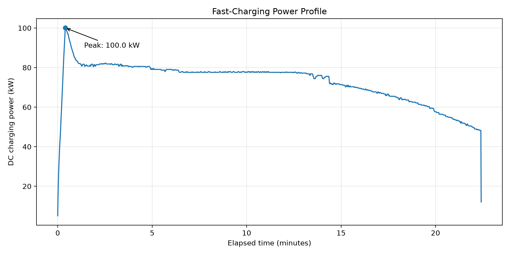
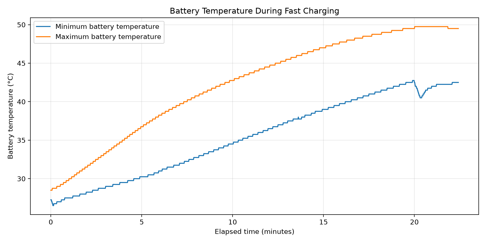
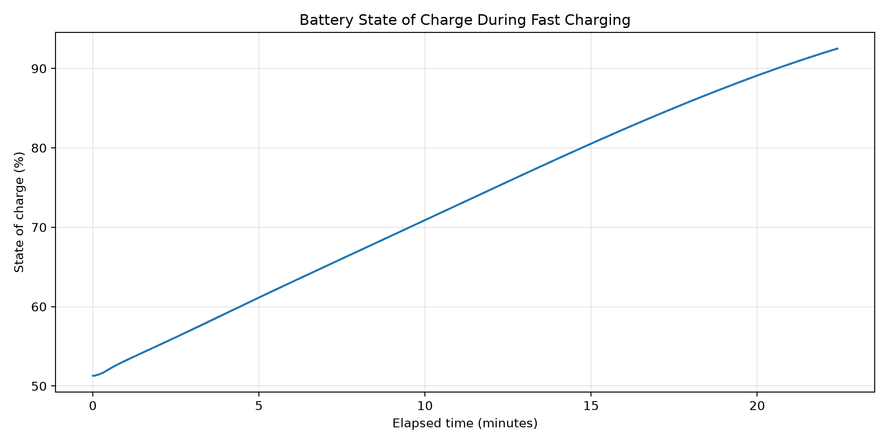

# EV Fast-Charging Telemetry Validator

A Python-based QA workflow for validating battery-electric vehicle fast-charging telemetry using timestamp checks, DBC-defined signal ranges, electrical constraints, charging behavior checks, and energy calculations.

## Charging Session

- **Records:** 1,346
- **Sampling interval:** 1 second
- **Duration:** Approximately 22 minutes
- **Peak calculated DC charging power:** Approximately 100 kW
- **Estimated DC energy:** 27.19 kWh
- **SOC increase:** 41.2 percentage points



## Validation Results

| Status | Checks |
|---|---:|
| PASS | 10 |
| WARN | 1 |
| FAIL | 0 |

The warning occurs at the final record, where charging voltage falls below the configured minimum voltage limit. It is treated as a session-boundary warning rather than an automatic failure.

## Validation Scope

- **Data integrity:** Missing timestamps, chronological ordering, duplicate timestamps, and 1-second sampling intervals.
- **Signal validation:** SOC, battery voltage, battery current, and battery-pack temperature consistency.
- **Electrical constraints:** Calculated DC power, configured power/current limits, and charging-voltage limits.
- **Charging behavior:** SOC progression and charging-session trends.
- **Energy calculation:** Integration of DC charging power over time.

## Visualizations

**Battery temperature**



**State of charge**



## Automated Tests

The test suite contains 14 tests covering timestamp integrity, signal ranges, electrical constraints, SOC progression, and energy calculations.

Run from the project root:

```bash
pytest
```

## Project Structure

```text
EV-Fast-Charging-Telemetry-Validator/
├── data/
│   └── sample/
│       └── Fast Charging Session/
│           └── BEV1_2024-08-10_fast_1.csv
├── reports/
│   ├── charging_power_profile.png
│   ├── battery_temperature_profile.png
│   └── soc_profile.png
├── src/
│   ├── inspect_session.py
│   └── visualize_session.py
├── tests/
│   └── test_validation.py
├── .gitignore
└── README.md
```

## Requirements

- Python 3
- pandas
- NumPy
- Matplotlib
- pytest

## Dataset and Attribution

The sample is derived from the publicly available **BEV Energy Dynamics Dataset** published by KU Leuven / EnergyVille.

Yasko, M., Moussa Issaka, A., Tian, F., Kazmi, H., Driesen, J., & Martinez, W. (2025). *Unveiling Energy Dynamics of Battery Electric Vehicle Using High-Resolution Data.* Scientific Data, 12, 1878.

- [Research paper](https://doi.org/10.1038/s41597-025-06148-5)
- Dataset DOI: [10.48804/8KPDTW](https://doi.org/10.48804/8KPDTW)

The full dataset is not included in this repository. Consult the original dataset's license and attribution requirements when using or redistributing its data.

## Limitations

This implementation analyzes one charging session and a selected set of signals. It does not decode every CAN signal, implement a battery-management system, or establish validation across multiple vehicles or sessions.

## License

The validation code and the third-party dataset sample have separate licensing considerations. Check the dataset's applicable terms before redistribution and specify a separate license for this project's code if desired.
